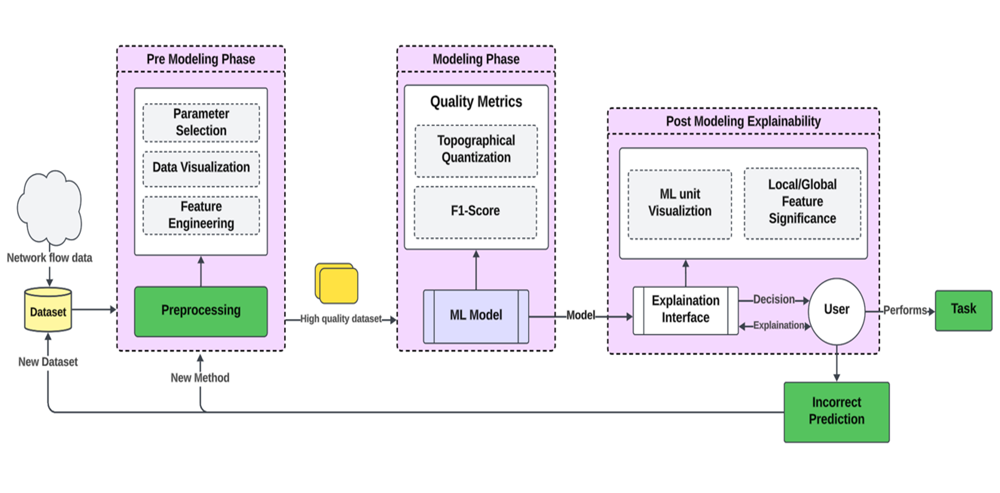

# XAI-IDS-Architecture

**XAI-IDS-Architecture** is an Explainable Artificial Intelligence (XAI) framework for Intrusion Detection Systems (IDS). This project focuses on enhancing the transparency, interpretability, and usability of machine learning-based IDS, making them actionable and trustworthy for cybersecurity analysts without compromising accuracy.

## 🚀 Motivation

Traditional IDS solutions, while effective in detecting cyber threats, often lack interpretability, making them less practical in high-stakes environments. Analysts need clear and actionable explanations for flagged threats to ensure trust and effective response. This project bridges the gap between detection and explainability by integrating XAI techniques into IDS.

## 🔍 Problem Statement

Modern IDS systems face challenges such as:

- **Opacity in Machine Learning Models**: Lack of interpretability in black-box models like deep learning.
- **False Positives and Negatives**: Misclassification of legitimate activities or missed threats.
- **Trust and Usability Issues**: Security analysts require explainable insights for validation.
- **Scalability and Adaptability**: Limited performance under high traffic and evolving threats.

## 🎯 Objectives

- Build an XAI-based IDS architecture that enhances transparency while maintaining high detection accuracy.
- Integrate explainability techniques such as SHAP (SHapley Additive ExPlanations) and LIME (Local Interpretable Model-Agnostic Explanations).
- Validate the architecture using benchmark datasets such as NSL-KDD and CICIDS-2017.
- Support analysts in mitigating threats with understandable, actionable insights.

## Design Architecture

Below is the design architecture of the **XAI-IDS-Architecture** project, which outlines the three phases of the system:

1. **Pre-Modeling Phase**: 
   - Parameter selection
   - Data visualization
   - Feature engineering
   - Preprocessing for a high-quality dataset

2. **Modeling Phase**:
   - Machine learning model training and evaluation
   - Quality metrics include F1-Score and topographical quantization

3. **Post-Modeling Explainability**:
   - Explanation interfaces provide local/global feature significance and ML unit visualization
   - Users receive actionable explanations to make decisions and handle incorrect predictions



This architecture ensures a systematic approach to creating an interpretable and effective intrusion detection system.


## 🛠️ Features

- **Notebook-Driven Workflow**: End-to-end pipeline is organized as phase-based Jupyter notebooks.
- **Multi-Class IDS Modeling**: Supports 5-class NSL-KDD and CICIDS-2017 experiments.
- **Imbalance-Aware Training**: Current NSL-KDD XGBoost flow supports class weighting and optional SMOTE.
- **Research-Ready Evaluation**: Includes confusion matrices (raw + normalized), class-wise PR/F1, macro/weighted summaries, and ROC-AUC.
- **Explainability Support**: SHAP/LIME-based post-modeling analysis notebooks.

## 🗂️ Project Structure

```plaintext
├── 1_Pre-Modeling-Phase/
│   ├── Data_Analysis_and_preprocessing_NSL-KDD/
│   └── Data_Analysis_and_Preprocessing_CICIDS-2017/
├── 2_Modeling-Phase/
│   ├── Models_NSL-KDD/
│   ├── Models_CICIDS-2017/
│   ├── Model Comparisons/
│   └── train_and_test_datasets/
├── 3_Post-Modeling-Phase/
│   ├── explainability_Models/
│   └── Trained_ML_models/
├── Datasets/
├── AGENTS.md
└── README.md
```
## 📊 Datasets

The project utilizes the following benchmark datasets:

1. **NSL-KDD**: A well-known dataset for network intrusion detection research.
1. **CICIDS-2017**: Represents realistic modern cyberattack scenarios.

---

## 🛠️ Installation

1. Clone this repository:

   ```bash
   git clone https://github.com/mo-abdulai/XAI-IDS-Architecture.git
   ```

2. Navigate to the project directory:

    ```bash
    cd XAI-IDS-Architecture
    ```

3. Install the required Python packages:

    ```bash
    pip install -r requirements.txt 
    ```


## 🧪 Usage

### Current Flow (Notebook-Based)

1. **Preprocess and analyze data**
   - NSL-KDD notebooks:
     - `1_Pre-Modeling-Phase/Data_Analysis_and_preprocessing_NSL-KDD/`
   - CICIDS-2017 notebooks:
     - `1_Pre-Modeling-Phase/Data_Analysis_and_Preprocessing_CICIDS-2017/`

2. **Train/evaluate models**
   - NSL-KDD modeling notebooks:
     - `2_Modeling-Phase/Models_NSL-KDD/`
   - CICIDS-2017 modeling notebooks:
     - `2_Modeling-Phase/Models_CICIDS-2017/`

3. **Run the current NSL-KDD XGBoost flow**
   - Notebook:
     - `2_Modeling-Phase/Models_NSL-KDD/NSL-KDD_XGBoost.ipynb`
   - Sections include:
     - Load train/test CSVs
     - Split features/labels and fixed 5-class order (`Normal, DoS, Probe, R2L, U2R`)
     - Class imbalance controls (`USE_CLASS_WEIGHTS`, `USE_SMOTE`)
     - XGBoost training
     - Evaluation:
       - raw confusion matrix
       - row-normalized confusion matrix
       - class-wise precision/recall/F1
       - sklearn classification report
       - macro/micro ROC-AUC

4. **Run explainability notebooks**
   - `3_Post-Modeling-Phase/explainability_Models/`

## 📈 Evaluation Metrics

- Accuracy
- Class-wise Precision, Recall, and F1-score
- Macro and weighted averages (from `classification_report`)
- Confusion matrix (raw counts)
- Confusion matrix (row-normalized)
- Macro and micro ROC-AUC (OVR)
- Explainability outputs via SHAP/LIME notebooks

## 🧩 Future Work

- Extend support for encrypted traffic analysis.
- Improve scalability for large-scale distributed networks.
- Integrate real-time monitoring and alerting.

## 📝 References

- S. Mane and D. Rao, "Explaining Network Intrusion Detection System Using Explainable AI Framework," Persistent Systems Limited, India, 2020.
- F. Wei, H. Li, Z. Zhao, and H. Hu, "xNIDS: Explaining Deep Learning-based Network Intrusion Detection Systems for Active Intrusion Responses," Proceedings of the 32nd USENIX Security Symposium, Anaheim, CA, 2023.
- C. Molnar, Interpretable Machine Learning: A Guide for Making Black Box Models Explainable, 2020. 
